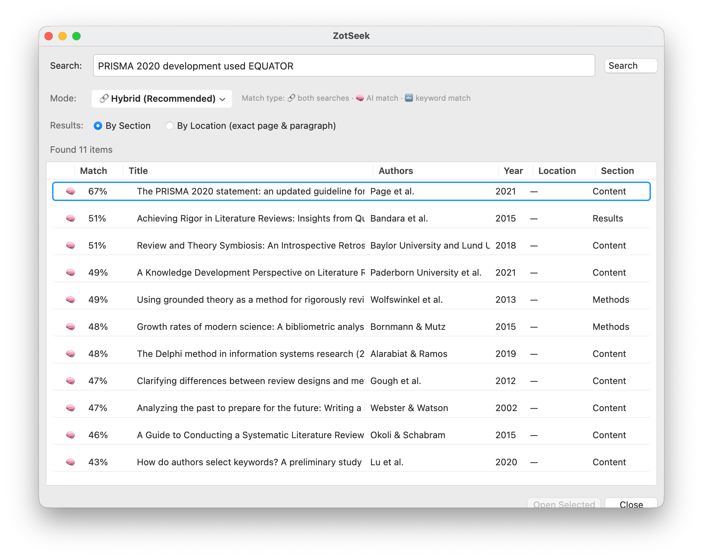
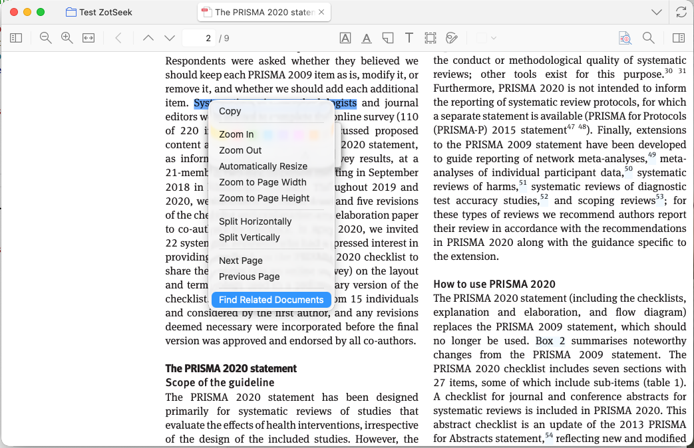
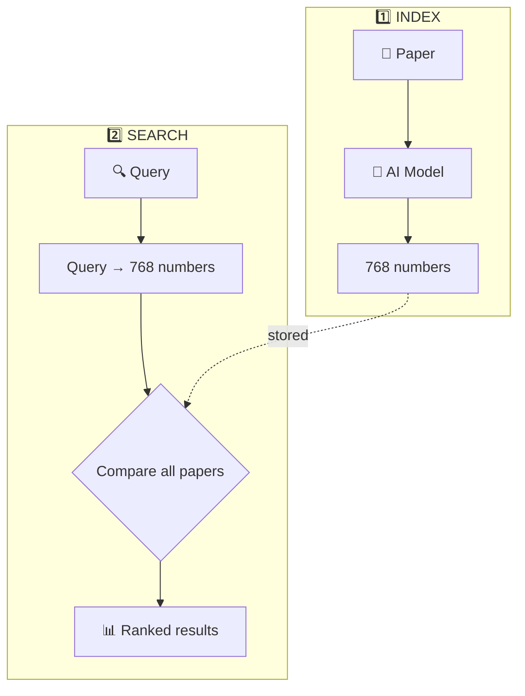
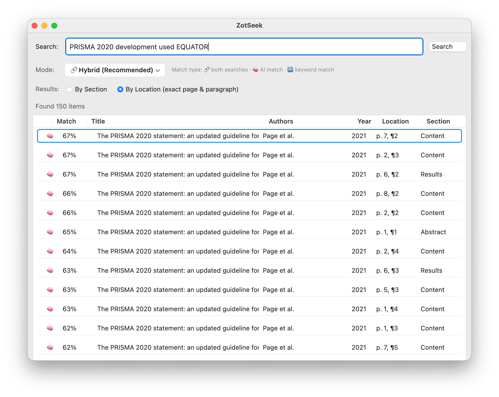
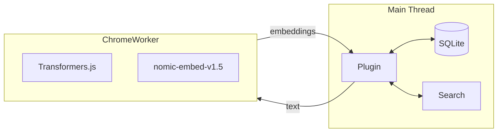

# ZotSeek | AI-Powered Semantic Search for Zotero

Find similar papers by **meaning**, not just keywords. 100% local, no data leaves your machine.

> **Status:** ✅ Stable release with Transformers.js running locally in Zotero 7 & 8



---

## Features

- 🔒 **100% Local** - No data sent to cloud, works completely offline
- 🧠 **True Semantic Search** - Find papers by meaning, not just keywords
- 🔍 **Find Similar Documents** - Right-click any paper → discover related research
- 📖 **Search from PDF Selection** - Select text while reading → right-click → find documents about that concept
- 🔎 **Natural Language Search** - Search with queries like "machine learning in healthcare"
- 🔗 **Hybrid Search** - Combines AI + keyword search for best results
- ⚡ **Lightning Fast** - Searches complete in <100ms
- 📑 **Section-Aware** - See which section matched (Abstract, Methods, Results)
- 📍 **Passage-Level Location** - Jump to exact page & paragraph in Full Document mode
- 🔄 **Auto-Index** - Automatically index new papers when you add them to your library
- 💾 **Crash-Resilient** - Checkpoint saving every 25 items, resume after interruption
- ⚙️ **Configurable** - Customize via Zotero Settings → ZotSeek (also accessible from search dialog)

---

## Privacy & Security

ZotSeek is designed with privacy as a core principle:

| Aspect | Guarantee |
|--------|-----------|
| **AI Model** | Bundled with the plugin (131MB) — no downloads, no API calls |
| **Processing** | All AI inference runs locally on your CPU/GPU |
| **Your Papers** | Only indexes items from your local Zotero library |
| **Network** | Zero network requests for search or indexing |
| **Storage** | Embeddings saved locally in `zotseek.sqlite` in your Zotero data folder |
| **Offline** | Works completely offline after installation |

**What this means:**
- Your research never leaves your machine
- No cloud services, no API keys, no subscriptions
- No telemetry or usage tracking
- Uninstalling the plugin removes all ZotSeek data

---

## More Screenshots

<details>
<summary>Click to expand</summary>

### Find Similar Documents


### Context Menu


### PDF Selection Context Menu


### Settings Panel


### Indexing Progress


</details>

---

## How It Works

### The Big Picture



**How it works:** Each paper becomes 768 numbers capturing its meaning. To search, we convert your query to numbers and find papers with similar numbers.

### Step-by-Step Process

#### 1️⃣ Indexing Your Library

When you use "Index Current Collection" or "Update Library Index":

```
For each paper:
  1. Extract title + abstract (Abstract mode)
     — OR —
     Extract PDF text page-by-page with exact page numbers (Full Document mode)
  2. Split into paragraphs, filter out References/Bibliography
  3. Send to local AI model (nomic-embed-text-v1.5)
  4. Model outputs 768 numbers per chunk (the "embedding")
  5. Save embeddings + location metadata to local database (zotseek.sqlite)
```

**Time:** ~3 seconds per chunk

#### 2️⃣ Finding Similar Documents

When you right-click → "Find Similar Documents":

```
  1. Load the selected paper's embedding
  2. Compare against all indexed papers (cached in memory)
  3. Rank by semantic similarity
  4. Show top results
```

**Time:** ~70ms (with cache)

---

## Hybrid Search

The plugin combines **semantic search** (AI embeddings) with **Zotero's keyword search** using **Reciprocal Rank Fusion (RRF)** for optimal results.

### Search Modes

| Mode | Best For | How It Works |
|------|----------|--------------|
| 🔗 **Hybrid** (Recommended) | Most searches | Combines semantic + keyword results |
| 🧠 **Semantic Only** | Conceptual queries | Finds related papers by meaning |
| 🔤 **Keyword Only** | Author/year searches | Exact title, author, year matching |

### Why Hybrid Search?

| Query Type | Pure Semantic | Pure Keyword | Hybrid |
|------------|---------------|--------------|--------|
| "trust in AI" | ✅ Great | ❌ Poor | ✅ Great |
| "Smith 2023" | ❌ Poor | ✅ Great | ✅ Great |
| "RLHF" | ⚠️ Maybe | ✅ Exact only | ✅ Both |

### Result Indicators

| Icon | Meaning |
|------|---------|
| 🔗 | Found by BOTH semantic and keyword (high confidence) |
| 🧠 | Found by semantic search only (conceptually related) |
| 🔤 | Found by keyword search only (exact match) |

### Section-Aware Results

The **Source** column shows which section of the paper matched your query:

| Source | Section Type |
|--------|--------------|
| Abstract | Title + Abstract |
| Methods | Introduction, Background, Methods |
| Results | Results, Discussion, Conclusions |
| Content | Generic (sections not detected) |

### Result Granularity (Full Document Mode)

When using **Full Document** indexing mode, you can toggle between two result views:

| Mode | Results | Best For |
|------|---------|----------|
| **By Section** (default) | 1 result per paper, best matching section | Overview of matching papers |
| **By Location** | All matching paragraphs with exact page & paragraph | Finding specific passages |

**By Section** - Aggregates all chunks per paper, shows the highest-scoring match:


**By Location** - Returns every matching paragraph individually with its own score:



In **By Location** mode, clicking a result opens the PDF to the exact page where the match was found.

For technical details, see [docs/SEARCH_ARCHITECTURE.md](docs/SEARCH_ARCHITECTURE.md).

---

## Indexing Modes

| Mode | What Gets Indexed | Best For |
|------|-------------------|----------|
| **Abstract** | Title + Abstract | Fast indexing, quick setup |
| **Full Document** (default) | PDF content split by sections | Deep content search, better results |

Configure via **Zotero → Settings → ZotSeek**.

### How Full Document Mode Works

For papers with PDFs, the chunker:
1. Extracts text page-by-page with exact page numbers
2. Splits each page into paragraphs
3. Prepends title to each chunk for context
4. **Automatically filters out References/Bibliography sections**

When searching, if *any* chunk matches your query, the paper ranks highly (MaxSim aggregation in "By Section" mode).

### References Filtering

The chunker automatically detects and excludes bibliography sections:
- Detects headers: "References", "Bibliography", "Works Cited", "Literature Cited"
- Recognizes citation patterns: `[1]`, `Smith, J. (2021).`, DOI links
- Stops indexing once references section is detected

This keeps your search results focused on the actual content of papers.

### Chunk Size Trade-offs

The `maxTokens` setting controls how text is split for embedding. It's a **ceiling, not a target** — chunks are split at paragraph boundaries and may be smaller.

| Chunk Size | Speed | Search Behavior |
|------------|-------|-----------------|
| **500-800** | Fast (~0.5s/chunk) | Higher precision, finds specific passages |
| **2000** | Moderate (~3s/chunk) | Balanced (default for Zotero 8) |
| **4000+** | Slow | Higher recall, finds broad topics |

**Version-aware defaults:** Zotero 7 uses 800 tokens (slower Firefox engine), Zotero 8 uses 2000 tokens.

**Recommendations:**
- Large libraries with full-paper indexing: use defaults
- Finding specific methodologies: try 500-600
- Broad topic discovery: try 2000-3000

For detailed chunking documentation, see [docs/SEARCH_ARCHITECTURE.md](docs/SEARCH_ARCHITECTURE.md#chunking-strategy).

---

## The AI Model

### nomic-embed-text-v1.5

| Property | Value |
|----------|-------|
| **Name** | [nomic-ai/nomic-embed-text-v1.5](https://huggingface.co/nomic-ai/nomic-embed-text-v1.5) |
| **Size** | 131 MB (quantized) |
| **Dimensions** | 768 (Matryoshka - can truncate to 256/128) |
| **Context Window** | 8192 tokens |
| **Speed** | ~3 seconds per chunk |
| **Quality** | Outperforms OpenAI text-embedding-3-small on MTEB |
| **Special Feature** | Instruction-aware prefixes for queries vs documents |

### Why This Model?

- ✅ **Superior retrieval quality** - Outperforms OpenAI text-embedding-3-small and jina-v2 on MTEB benchmarks
- ✅ **8K context window** - Most papers fit in 1-3 chunks (vs 10-20 with 512-token models)
- ✅ **Instruction-aware** - Uses `search_document:` for indexing and `search_query:` for queries
- ✅ **Matryoshka embeddings** - 768 dims can be truncated to 256/128 with minimal quality loss
- ✅ **Fully open** - Open weights, open training data, reproducible
- ✅ **Works in Zotero** - Compatible with Transformers.js v3 via wasmPaths configuration

### How Embeddings Work

The model converts text into 768 numbers that capture semantic meaning:

```
"Machine learning for medical diagnosis"  →  [0.023, -0.045, 0.012, ...]
"AI in healthcare applications"           →  [0.021, -0.048, 0.015, ...]  ← Similar!
"Organic chemistry synthesis"             →  [-0.089, 0.034, 0.067, ...]  ← Different!
```

Papers with **similar meanings** have **similar numbers**, even if they use different words.

---

## Architecture

### System Overview



### Why ChromeWorker?

Transformers.js can't run directly in Zotero's main thread because:
- Missing browser globals (`self`, `navigator`, `indexedDB`)
- Cache API crashes Zotero
- Would block UI during model inference

**Solution:** Run in a separate ChromeWorker thread with special configuration.

### Data Storage

Embeddings are stored in a **separate SQLite database** (`zotseek.sqlite`) attached to Zotero's connection:

- **Location:** `<Zotero Data Directory>/zotseek.sqlite` (shown in Settings → ZotSeek)
- **Size:** ~15KB per paper (abstract mode), ~150KB per paper (full document mode)
- **Benefits:** O(1) indexed lookups, in-memory caching, atomic updates, clean uninstall

The SQLite backend uses the **ATTACH DATABASE** pattern (inspired by Better BibTeX):
- **Separate file** - Keeps Zotero's main database clean and unbloated
- **Smart caching** - Pre-normalized Float32Arrays cached in memory after first search
- **Reliable queries** - Uses `columnQueryAsync()` and `valueQueryAsync()` for robust data retrieval
- **Clean uninstall** - Database file automatically removed when plugin is uninstalled

---

## Cosine Similarity

The math behind "how similar are two papers":

$$\text{similarity} = \frac{A \cdot B}{\|A\| \times \|B\|}$$

Where:
- **A · B** = sum of (a[i] × b[i]) for all 768 dimensions
- **‖A‖** = sqrt(sum of a[i]²)
- **‖B‖** = sqrt(sum of b[i]²)

**Result:** 0.0 (completely different) to 1.0 (identical)

**Interpretation:**
- 0.9+ = Very similar (probably same topic)
- 0.7-0.9 = Related topics
- 0.5-0.7 = Loosely related
- <0.5 = Different topics

---

## Installation

### Development Setup

```bash
# Clone the repository
git clone https://github.com/introfini/ZotSeek
cd zotseek

# Install dependencies (includes zotero-plugin-toolkit for stable progress windows)
npm install

# Build the plugin
npm run build

# Create extension proxy file (macOS)
echo "$(pwd)/build" > ~/Library/Application\ Support/Zotero/Profiles/*.default/extensions/zotseek@zotero.org

# Restart Zotero with debug console
open -a Zotero --args -purgecaches -ZoteroDebugText -jsconsole
```

### Building for Distribution

```bash
cd build
zip -r ../zotseek.xpi *
```

Install via: Zotero → Tools → Add-ons → Install Add-on From File

---

## Usage

### Index Your Library

1. Right-click on a collection → **"Index Current Collection"**
2. Or use **"Update Library Index"** to index all items
3. A progress window will appear showing:
   - Current item being processed
   - Progress percentage
   - Estimated time remaining (ETA)
   - Option to cancel at any time
4. Indexing speed: ~3 seconds per chunk

**Crash-Resilient Indexing:**
- Progress is saved every 25 items (checkpoint saving)
- If Zotero crashes or you need to stop, simply re-run "Update Index"
- Already-indexed items are automatically skipped
- No need to start over from scratch

**Progress Window Features:**
- ✅ AI model loaded status
- ✅ Extraction progress (chunks from items)
- 📊 Current paper being processed
- 📈 Progress bar with percentage
- ⏱️ ETA countdown
- ❌ Cancel button

### Find Similar Documents

1. Select any paper in your library
2. Right-click → **"Find Similar Documents"**
3. Results appear showing similarity percentages

### Search from PDF Selection

While reading a PDF, you can search for related documents based on selected text:

1. Open a PDF in Zotero's reader
2. Select a passage that describes a concept you want to explore
3. Right-click → **"Find Related Documents"**
4. ZotSeek opens with the selected text as the search query
5. Results show documents related to that concept (current document is excluded)

This is useful for:
- Exploring unfamiliar concepts while reading
- Finding additional sources on a specific topic
- Discovering related work mentioned in a paper

### Auto-Index New Papers

ZotSeek can automatically index papers as you add them to your library:

1. Go to **Zotero → Settings → ZotSeek**
2. Enable **"Auto-index new items"**
3. Now when you add papers (via browser connector, drag & drop, etc.), they'll be indexed automatically

**How it works:**
- Detects when new items are added to your library
- Waits for PDF attachments to arrive (with automatic retry)
- Batches multiple items together (5 second delay)
- Shows a brief progress indicator while indexing
- Respects your indexing mode setting (Abstract or Full Document)

### ZotSeek Search Dialog

1. Click the **ZotSeek button** in the toolbar (🔍✨)
2. Or right-click → **"Open ZotSeek..."**
3. Enter a natural language query (e.g., "machine learning for medical diagnosis")
4. View results ranked by semantic similarity
5. Double-click any result to open it in Zotero
6. Click **⚙ Settings** (bottom-left) to quickly access ZotSeek preferences

### View Debug Output

Help → Debug Output Logging → View Output

Look for `[ZotSeek]` entries.

---

## Configuration

### Settings Panel

Access settings via **Zotero → Settings → ZotSeek** (or **Zotero → Preferences** on macOS).

The settings panel allows you to configure:
- **Indexing Mode**: Abstract only or Full Document
- **Search Options**: Maximum results, minimum similarity threshold
- **Actions**: Clear index, re-index library

### Preferences Reference

Preferences are stored in Zotero's preferences system:

**Search Settings:**

| Preference | Default | Description |
|------------|---------|-------------|
| `zotseek.minSimilarityPercent` | `30` | Minimum similarity % to show in results |
| `zotseek.topK` | `20` | Maximum number of results |
| `zotseek.autoIndex` | `false` | Automatically index new papers when added |

**Indexing Settings:**

| Preference | Default | Description |
|------------|---------|-------------|
| `zotseek.indexingMode` | `"full"` | `"abstract"` or `"full"` |
| `zotseek.maxTokens` | 800 / 2000 | Max tokens per chunk (800 on Zotero 7, 2000 on Zotero 8) |
| `zotseek.maxChunksPerPaper` | `100` | Max chunks per paper |

**Hybrid Search Settings:**

| Preference | Default | Description |
|------------|---------|-------------|
| `zotseek.hybridSearch.enabled` | `true` | Enable hybrid search |
| `zotseek.hybridSearch.mode` | `"hybrid"` | `"hybrid"`, `"semantic"`, or `"keyword"` |
| `zotseek.hybridSearch.semanticWeightPercent` | `50` | Semantic weight (0-100) |
| `zotseek.hybridSearch.rrfK` | `60` | RRF constant |
| `zotseek.hybridSearch.autoAdjustWeights` | `true` | Auto-adjust based on query |

You can also access preferences via `about:config` (Help → Debug Output Logging → View Output, then navigate to `about:config`).

---

## Performance

Tested on MacBook Pro M3:

| Operation | Time |
|-----------|------|
| Model loading | ~1.5 seconds (bundled, 131MB) |
| Index 1 chunk | ~3 seconds (optimized from ~45s) |
| Index 10 papers (40 chunks) | ~2 minutes |
| **First search** | ~130ms (loads cache) |
| **Subsequent searches** | **~70ms** (uses cache) |
| **Hybrid search** | ~70ms (with cache) |
| Storage size | ~130 KB per 10 papers (full mode) |
| Memory usage (cached) | +75MB for 1,000 papers |

### Performance Optimizations

The plugin includes several performance optimizations:

1. **Version-Aware Chunk Size** - 800 tokens on Zotero 7 (~0.5s), 2000 tokens on Zotero 8 (~3s) — avoids O(n²) attention bottleneck
2. **In-Memory Caching** - Embeddings cached after first search
3. **Pre-normalized Vectors** - Float32Arrays normalized on load for fast dot product
4. **Parallel Searches** - Semantic and keyword searches run simultaneously
5. **Reliable SQLite Methods** - Uses `columnQueryAsync()` and `valueQueryAsync()`

### GPU Acceleration (Experimental)

ZotSeek automatically detects and uses **WebGPU** for GPU-accelerated embeddings when available:

| Backend | When Used | Speed |
|---------|-----------|-------|
| **WebGPU (GPU)** | If browser/Zotero supports WebGPU | Up to 10-20x faster |
| **WASM (CPU)** | Fallback when WebGPU unavailable | ~3 seconds per chunk |

**Current status (January 2026):**
- Firefox 141 shipped WebGPU on **Windows only** (July 2025)
- **macOS and Linux** WebGPU support coming in future Firefox versions
- Zotero 8 is based on Firefox 140 ESR (one version before WebGPU)

**When will GPU work?** Once Zotero upgrades to a Firefox ESR with WebGPU support for your platform, GPU acceleration will automatically activate — no plugin update needed.

**Check if GPU is being used:** Look for "Model loaded on GPU" or "Model loaded on CPU" in Zotero's debug console (Help → Debug Output Logging → View Output).

Note: If WebGPU is unavailable or fails, the plugin automatically falls back to CPU without interruption.

---

## Limitations

- **English only** - Model is trained on English text
- **Large plugin size** - ~131MB due to bundled AI model
- **CPU only (for now)** - GPU acceleration ready but waiting for Zotero/Firefox WebGPU support
- **Zotero 7 slower for Full Document mode** - Firefox 115 (Zotero 7) has slower WASM performance than Firefox 140 (Zotero 8). Full Document indexing is ~8-10x slower on Zotero 7. **Recommendation:** Use Abstract mode for faster indexing on Zotero 7, or upgrade to Zotero 8 for best performance.

---

## Comparison with OpenAI

| Feature | This Plugin (Local) | OpenAI API |
|---------|--------------------| -----------|
| **Cost** | Free | ~$0.02 per 1K papers |
| **Privacy** | 100% local | Data sent to OpenAI |
| **Offline** | Yes (after model loads) | No |
| **Quality** | Excellent (outperforms text-embedding-3-small) | Good |
| **Speed** | ~70-130ms | ~100ms |
| **Context** | 8192 tokens | 8191 tokens |

---

## Technical Details

See the [docs/](docs/) folder for detailed documentation:

- [**DEVELOPMENT.md**](docs/DEVELOPMENT.md) - Development guide, ChromeWorker + Transformers.js implementation
- [**SEARCH_ARCHITECTURE.md**](docs/SEARCH_ARCHITECTURE.md) - Hybrid search, RRF fusion, chunking strategy

---

## Changelog

See [CHANGELOG.md](CHANGELOG.md) for version history.

## License

MIT License - see [LICENSE](LICENSE)

---

## Acknowledgments

- [Transformers.js](https://huggingface.co/docs/transformers.js) by Hugging Face
- [sentence-transformers](https://www.sbert.net/) for the embedding model
- [Zotero](https://www.zotero.org/) for the amazing reference manager
- [windingwind's Zotero Plugin Docs](https://windingwind.github.io/doc-for-zotero-plugin-dev/) for invaluable guidance

---

*ZotSeek: AI-Powered Semantic Search for Zotero — Built by José Fernandes*
